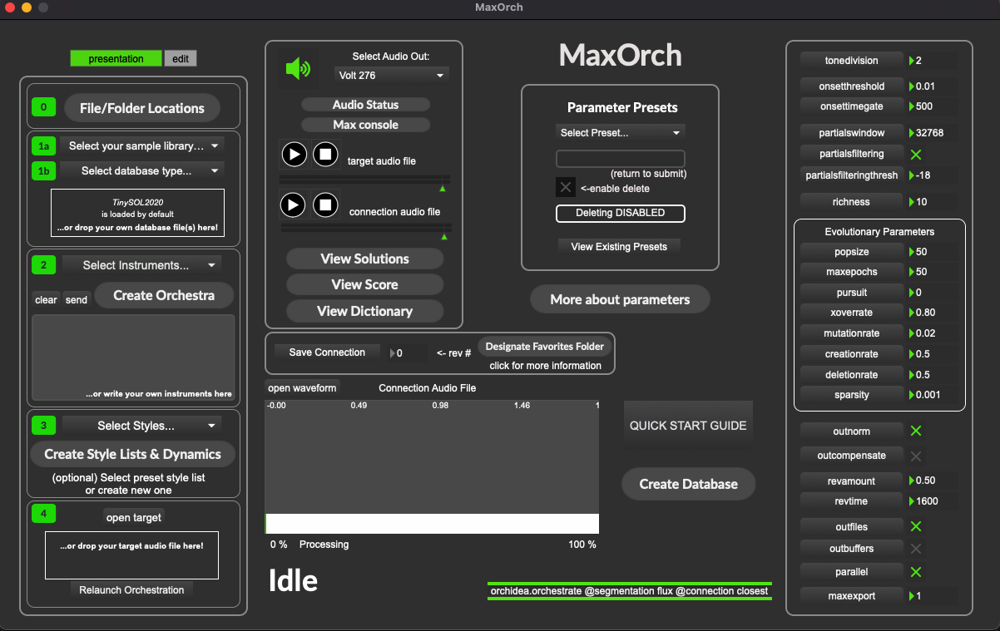

# [MaxOrch download link](http://maxorch.com/)

# Version 0.7.2b
## By Jérôme Lesueur and Per Bloland

  

### A front end patch for the [Orchidea](http://www.orch-idea.org/) Max package

### Application available [here](https://git.forum.ircam.fr/smalllotus/maxorch/-/tree/App)

*Do not move the patch out of its folder, otherwise it won't find the necessary files.*

-------

Note: you must install at least one SOL database (see below). We sincerely invite you to install all databases for Orchidea, they all have a different spirit and it's really amazing to compare them.

Important: Use a clean sound (especially with transients) with an adapted headroom... the better the signal is, the better the orchestration will be... 

### This is a beta release - please report any bugs/issues/requests to the [discussion room](https://discussion.forum.ircam.fr/c/maxorch/). Feel free to contact us there as well if you have any questions!

## Due to the different versions of Max, think about saving the patch and reloading the patch the first time you load your patch in order to make it work.

# Installation (Max patch):

### Notify that TinySol2020 is pre-loaded when the patch is launched

#### System Requirements: Orchidea, and thus MaxOrch, are currently Mac only.
### NOTE: MaxOrch and Orchidea are natively compatible with Apple's M1 processor.

### - 1: Install [Bach, Cage, and Dada](https://www.bachproject.net/dl/)

### - 2: Install Orchidea v.0.7 Max Package from [Orchidea page](http://www.orch-idea.org/)

### - 3: Download SOL datasets, ([TinySOL2020](https://forum.ircam.fr/projects/detail/tinysol/), [OrchideaSOL2020](https://forum.ircam.fr/projects/detail/orchideasol/) - *recommended*, [FullSOL2020](https://forum.ircam.fr/projects/detail/fullsol/)). See below for more details.

#### See links below.

#### A few notes on the databases and database installation:
- TinySOL2020 is included with the Orchidea download,
- OrchideaSOL is recommended - it is the most comprehensive free db,
- FullSOL requires an IRCAM Forum premium account,
- Several custom databases are available from the Orchidea page.
- You may install a downloaded database by copying its folder contents into the following folder: **~/Documents/Max 8/Packages/orchidea/db/**. 
- **-OR-** You can place database folders anywhere on your drive and point MaxOrch to their locations.
- You may install multiple databases into the same folder,
- You don't need the metadata folders.

-------

### Refer to:
>  - [TinySOL2020 Ircam forum page](https://forum.ircam.fr/projects/detail/tinysol/)
>  - [OrchideaSOL2020 Ircam forum page](https://forum.ircam.fr/projects/detail/orchideasol/)
> - [FullSOL2020 Ircam forum page](https://forum.ircam.fr/projects/detail/fullsol/)

### Follow the Orchidea [YouTube](https://www.youtube.com/channel/UCvQqqpZmCWSIy6k4urWKjIw) channel
-------
### Works with Max 8.6 and Orchidea package v.0.7 (XMAS Release) in 64 bits Universal

